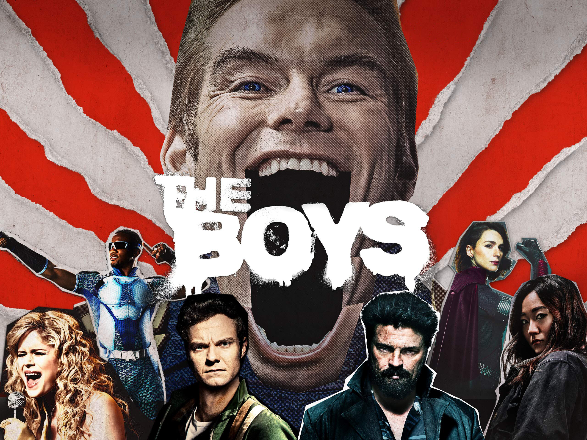
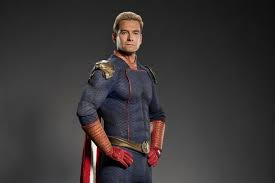
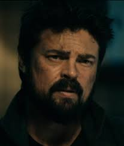
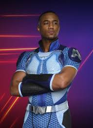
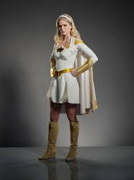
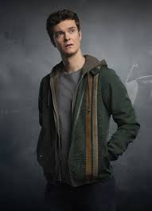

<!DOCTYPE html>
<html>
<body style="background-color: black;">
</body>  

      <h1 style="color: red;">The Boys</h1>
        
      <h2 style="color: darkturquoise;">About</h2>
      
The Boys is an American media franchise, consisting of action-drama/satirical black comedy superhero television series which follow the residents of a world where superpowered individuals called Supes are recognized as heroes by the general public and work for a powerful corporation known as Vought International, which markets, monetizes, and (secretly) creates them, with most being selfish and corrupt outside of their heroic personas. Based on the comic book series of the same name by Garth Ennis and Darick Robertson, originally published by DC Comics under its Wildstorm imprint before moving to Dynamite Entertainment, the television franchise debut has garnered success both financially and critically.

         The first season of The Boys, developed by Eric Kripke with executive producers Seth Rogen and Evan Goldberg, was released in July 2019, with an ensemble cast led by Jack Quaid, Erin Moriarty, Karl Urban, and Antony Starr. A second season, with Colby Minifie and Aya Cash, was released from September to October 2020, a third season, with Claudia Doumit and Jensen Ackles, was released from June to July 2022, and a fourth season was released from June to July 2024, with an animated spin-off anthology series, The Boys Presents: Diabolical, releasing in March 2022, and an Audible podcast, The Boys: Deeper and Deeper, starring Chace Crawford, Katy Breier, and Leigh Bush, releasing in June 2022. The series were released via Amazon Prime Video, while the promotional web series VNN: Seven on 7 with Cameron Coleman and sponsored promotional episodes of Death Battle! were released via YouTube from 2020 to 2022.
         
         The franchise continued with a live-action spin-off series, Gen V, starring Jaz Sinclair, Lizze Broadway, Maddie Phillips, London Thor, Derek Luh, and Asa Germann, and centered around the franchise's young adult Supes, with a fifth and final season of The Boys also being in development. 

      <h2 style="color: darkturquoise;">Characters</h2>
      
1.HOMELANDER   2.BILLY BUTCHER   3.SOLDIERBOY  4.A TRAIN   5.STARLIGHT  6.HUGHIE
 
      <h2 style="color: aqua;">HOMELANDER</h2>
      
      
Homelander is a complex character in "The Boys," embodying themes of power, corruption, and narcissism. He represents the darker side of heroism, showcasing traits like manipulation, jealousy, and sadism, while also reflecting societal issues such as materialism and individualism. ### Character Overview.he is the  phsycopath villain.

         Homelander's character critiques the idealization of superheroes and the corrupting influence of power.
         His actions highlight the emptiness of seeking validation through fear and dominance.A pivotal moment where he chooses to protect his image over saving passengers, showcasing his lack of empathy.Homelander serves as a deconstruction of the traditional superhero archetype, embodying the dualities of hope and oppression. His character invites viewers to reflect on the nature of power, the consequences of unchecked authority, and the importance of genuine human connections.
     
     

     <h2 style="color: aqua;"> BILLY BUTCHER</h2>
      
      
Billy Butcher is a complex character from "The Boys," embodying a blend of charm, cunning, and deep-seated rage. As a former CIA operative and British special forces member, he is driven by a personal vendetta against superheroes, particularly Homelander, due to the trauma of losing his wife, Becca. Butcher's ruthless methods and Machiavellian tactics reveal his willingness to become the very monster he despises in order to achieve his goals. His character is marked by a profound sense of betrayal and a desire for revenge, which often leads him to act in morally ambiguous ways. Despite his violent tendencies and prejudices against "supes," Butcher's charisma and leadership skills make him a compelling figure, illustrating the blurred lines between heroism and villainy in a world where power corrupts. Billy Butcher's character is further complicated by his relationships and personal flaws. He often displays a self-absorbed nature, prioritizing his vendetta over the well-being of those around him, including his team, the Boys. This selfishness manifests in his willingness to manipulate and use others as pawns in his quest for revenge, showcasing a lack of respect for their autonomy and feelings. His excessive violence and ruthlessness are not just tools for achieving his goals but also reflect a deeper psychological struggle, as he grapples with his obsession and the lengths he is willing to go to for justice.

         Moreover, Butcher's dishonesty and tendency to withhold the truth from his allies create a toxic environment, undermining trust within the group. His prejudiced views towards superheroes further complicate his character, as he often fails to see the individuality of those with powers, painting them all with the same brush due to his traumatic past. This dangerous mindset not only fuels his aggression but also poses a risk to his mission and the people he claims to protect. Ultimately, Billy Butcher serves as a tragic figure, caught in a cycle of vengeance and moral ambiguity, illustrating the complexities of human nature when faced with loss and betrayal.

      <h2 style="color: aqua;"> SOLDIER BOY</h2>
      
      
Soldier Boy is a multifaceted character in "The Boys," embodying the quintessential American superhero archetype, yet marred by a toxic blend of arrogance, machismo, and recklessness. As the first American non-aging Supe, created by Frederick Vought, Soldier Boy's character is deeply rooted in the ideals of patriotism and heroism, but his actions often betray these values. His persona is marked by an inflated sense of self-importance, as he sees himself as the epitome of American strength and masculinity. This self-aggrandizing attitude is coupled with a complete disregard for the well-being of others, as he prioritizes his own interests and ambitions above all else. Soldier Boy's character is also defined by his toxic masculinity, which manifests in his aggressive behavior, misogyny, and homophobia. His actions are often driven by a desire to assert his dominance and prove his superiority, rather than a genuine concern for justice or the greater good. Despite his flaws, Soldier Boy remains a complex and intriguing character, serving as a commentary on the darker aspects of American culture and the dangers of unchecked patriotism and masculinity. His backstory reveals a troubled upbringing in Philadelphia, where he was expelled from boarding school and subsequently joined the military, leveraging his father's wealth to become part of the Vought trials. This journey led him to become "America's Son," a title that highlights his status as a celebrated yet deeply flawed figure. Living in a sealed pod within a high-security lab, Soldier Boy's existence is a stark contrast to the heroic image he projects.

            In terms of relationships, Soldier Boy is currently single, having recently ended a long-term relationship marked by betrayal. His womanizing tendencies and the possibility of having multiple children scattered across the globe add layers to his character, as he grapples with the desire to be a better father than his own. This internal conflict is compounded by his struggle to accept his diminishing relevance in a world that has moved on without him, leading to feelings of bitterness and resentment.
            
            Personality-wise, Soldier Boy embodies the archetype of the proud, arrogant "Alpha" male, often resorting to bullying and belittling those around him. His reckless behavior and complete disregard for others make him a polarizing figure, yet he remains someone who can be relied upon to complete a mission, albeit in a morally questionable manner. Ultimately, Soldier Boy serves as a reflection of toxic masculinity and the complexities of heroism, illustrating the fine line between being a celebrated figure and a deeply flawed individual.

      
      <h2 style="color: aqua;"> A TRAIN</h2>
      
      
A-Train is a complex character in "The Boys," serving as a satirical representation of the modern superhero archetype, particularly in the context of fame, power, and the consequences of unchecked ambition. As the fastest man alive, A-Train embodies the quintessential traits of a superhero, yet his character is deeply flawed, driven by a relentless desire for recognition and validation. His journey is marked by a constant struggle to maintain his status within the Seven, the elite group of superheroes, which leads him to make increasingly reckless and morally questionable decisions. A-Train's character is defined by his ambition and insecurity; despite his superhuman abilities, he often feels overshadowed by his peers, particularly Homelander, which fuels his desperation to prove himself.

         A-Train's actions are often driven by a need for approval and a fear of losing his place in the spotlight. This obsession with fame leads him to engage in dangerous behavior, including the use of performance-enhancing drugs, which ultimately results in tragic consequences, such as the death of Hughie's girlfriend, Robin. This pivotal moment serves as a turning point in the series, highlighting the moral ambiguity of A-Train's character and the collateral damage that often accompanies the pursuit of glory. His willingness to prioritize his career over human life underscores the darker aspects of celebrity culture and the ethical dilemmas faced by those in positions of power.
         
         Moreover, A-Train's relationships are fraught with tension and manipulation. His interactions with other members of the Seven, particularly with Homelander and Starlight, reveal a character who is both competitive and deeply insecure. He often resorts to bullying and intimidation to assert his dominance, yet he is also portrayed as a character seeking redemption and acceptance. This duality makes A-Train a tragic figure, as he grapples with the consequences of his actions while yearning for a sense of belonging and purpose.
         
         Ultimately, A-Train serves as a critique of the superhero genre and the societal obsession with fame and success. His character arc illustrates the dangers of ambition unchecked by morality, as well as the personal toll that comes with the relentless pursuit of power. Through A-Train, "The Boys" challenges viewers to reflect on the complexities of heroism and the often-hidden costs of living in a world where 

      
      <h2 style="color: aqua;"> STARLIGHT</h2>
      
      
Starlight, also known as Annie January, is a compelling character in "The Boys," representing the struggle between idealism and the harsh realities of a corrupt superhero world. Initially introduced as a bright-eyed and hopeful hero, Starlight's journey quickly becomes a disillusioning experience as she confronts the dark underbelly of the superhero community, particularly within the Seven. Her character embodies the conflict between her desire to be a genuine force for good and the manipulative, often predatory nature of her peers, which forces her to navigate a morally ambiguous landscape. As she grapples with betrayal and the abuse of power, Starlight evolves from a naive newcomer into a more resilient and determined individual, ultimately seeking to redefine what it means to be a hero. Her story arc highlights themes of empowerment, the importance of integrity, and the fight against systemic corruption, making her one of the most relatable and complex characters in the series. Character Overview

      
      <h2 style="color: aqua;"> HUGHIE</h2>
      
      
Hughie Erskine, the protagonist of Oscar Wilde's "The Model Millionaire," is a charming yet impractical young man navigating the complexities of 1880s London society. Despite his good looks and amiable nature, Hughie faces financial struggles that challenge his romantic ideals. His kind-heartedness and generosity shine through, particularly in his interactions with those less fortunate, revealing a deep empathy that contrasts with his often naive outlook on life. As he grapples with societal expectations and personal aspirations, Hughie's character embodies the tension between appearance and reality, ultimately highlighting the importance of genuine kindness over material wealth. His journey serves as a poignant reminder of the value of compassion in a world preoccupied with status and riches. Character Overvie

      
      <h2 style="color: yellow;">Imdb:</h2>
      <a href="https://www.imdb.com/title/tt1190634/">visit Imdb</a>
      
      

</html>
